# 隐私短视频社交平台 - 产品需求文档

## 1. Product Overview

本产品是一个结合主流短视频平台功能与企业级隐私保护的社交平台。用户可以创作、分享短视频内容，同时享受端到端加密的私密通讯和强大的隐私保护机制。

* 解决传统短视频平台隐私泄露问题，为用户提供安全的内容创作和社交环境

* 目标成为注重隐私保护的年轻用户首选的短视频社交平台

* 当前版本：v0.0.0，基于React 18.3.1 + TypeScript 5.8.3 + Vite 6.3.5技术栈开发

## 2. Core Features

### 2.1 User Roles

| Role | Registration Method | Core Permissions    |
| ---- | ------------------- | ------------------- |
| 普通用户 | 手机号/邮箱注册            | 观看视频、点赞评论、关注用户、发布视频 |
| 创作者  | 普通用户升级认证            | 获得创作者标识、数据分析、变现功能   |
| 管理员  | 内部邀请                | 内容审核、用户管理、系统配置      |

### 2.2 Feature Module

我们的隐私短视频社交平台包含以下28个核心页面（已实现）：

1. **首页**：视频推荐流、6个Tab导航栏、搜索功能、广场入口、开始直播快捷按钮、增强视频播放器、横向滚动导航
2. **拍摄页面**：视频录制、本地视频上传、高级编辑工具、特效滤镜、语音转文字、自拍模式、直播模式切换
3. **图片发布页**：照片编辑、滤镜特效、图文混排、隐私设置、水印保护
4. **直播页面**：实时直播、观众互动、礼物打赏、直播回放、多入口访问、弹幕系统、连麦功能、实时翻译
5. **个人主页**：用户资料、发布视频、粉丝关注、作品展示、数据统计、粉丝互动
6. **消息页面**：私聊列表、群聊、系统通知、语音消息、消息搜索
7. **聊天详情页**：端到端加密聊天、文件传输、实时翻译、语音转文字、阅后即焚、群聊管理
8. **发现页面**：热门话题、用户推荐、内容分类、热门直播区域、实时观看人数
9. **广场页面**：瀑布流布局、搜索筛选、分类标签、无限滚动、懒加载、点赞交互
10. **钱包页面**：余额管理、充值提现、交易记录、收益统计、加密货币管理、安全验证、支付安全机制
11. **商城页面**：商品浏览、购物车、订单管理、支付结算、商家入驻、评价系统
12. **二手市场页**：二手商品交易、商品发布、交易管理、用户评价系统
13. **广告中心**：广告投放、数据分析、营销工具、推广管理、ROI优化、效果预估
14. **设置页面**：隐私设置、账户管理、安全选项、AI功能配置、反诈骗设置、邮箱验证
15. **AI字幕中心**：字幕管理、翻译设置、语音配置、批量操作、搜索筛选、导出功能
16. **内容审核中心**：举报处理、违规检测、申诉管理、自动审核、人工复审
17. **数据分析中心**：用户画像、内容分析、收益报告、趋势预测、市场洞察
18. **加密货币中心**：数字钱包、汇率转换、交易管理、安全设置、多币种支持
19. **反诈骗中心**：风险监控、异常检测、安全教育、举报处理、AI防护
20. **悬赏任务中心**：任务发布、任务浏览、竞标管理、质押机制、信用评级、媒体文件上传
21. **悬赏发布页**：任务描述、媒体上传（拖拽上传、进度显示、文件预览）、地理定位、预算设置
22. **悬赏详情页**：任务详情、竞标列表、进度跟踪、文件提交、完成验证、评价系统
23. **悬赏管理页**：我的发布、我的接单、收益统计、信用记录、争议处理
24. **悬赏规则页**：平台规则、使用说明、费用标准、争议处理流程
25. **信用中心页**：信用评级、历史记录、信用提升、违约处理、信用报告
26. **视频详情页**：视频播放、评论互动、分享收藏、用户信息展示
27. **视频调试页**：开发调试工具、视频测试功能、性能监控
28. **登录页面**：邮箱验证登录、两步验证、密码重置、安全登录
29. **注册页面**：邮箱验证注册、用户协议、隐私政策、账户创建

### 2.3 Page Details

| Page Name | Module Name | Feature description                                                   |
| --------- | ----------- | --------------------------------------------------------------------- |
| 首页        | 视频推荐流       | 基于AI算法的个性化视频推荐，支持无限滚动加载，懒加载优化                                         |
| 首页        | 导航栏         | 6个主要功能入口：首页、发现、拍摄、直播（红色主题）、消息、个人                                      |
| 首页        | 开始直播按钮      | 一键开始直播，快速进入直播模式                                                       |
| 首页        | 搜索功能        | 顶部导航栏右侧搜索按钮，展开/收起搜索框，支持视频、用户、话题搜索，热门搜索标签                              |
| 首页        | 广场入口        | 顶部导航栏广场入口，跳转到瀑布流内容页面                                                  |
| 首页        | 横向滚动导航      | 顶部导航支持滑动浏览，移动端优化                                                      |
| 首页        | 增强视频播放器     | 进度控制、音量调节、播放速度、全屏模式、画质选择、状态显示                                         |
| 视频详情页     | 视频播放器       | 支持全屏播放、画质调节、播放速度控制、进度拖拽                                               |
| 视频详情页     | 智能字幕        | AI自动生成字幕，支持多语言翻译，字幕时间同步                                               |
| 视频详情页     | 评论互动        | 实时评论、点赞、分享、收藏功能，评论管理                                                  |
| 视频详情页     | 用户信息        | 发布者头像、昵称、关注按钮、用户主页链接                                                  |
| 拍摄页面      | 视频录制        | 支持多种分辨率录制，实时预览，本地视频上传                                                 |
| 拍摄页面      | 本地视频上传      | "从相册选择"按钮、文件选择器、视频预览、无缝集成到编辑发布流程                                      |
| 拍摄页面      | 模式切换        | 录制模式与直播模式一键切换，自拍模式                                                    |
| 拍摄页面      | 自拍模式        | 美颜滤镜、人像模式、定时拍摄、手势识别、表情检测                                              |
| 拍摄页面      | 语音转文字       | 实时语音识别，自动生成字幕，离线处理                                                    |
| 拍摄页面      | 高级编辑工具      | 剪辑、滤镜、特效、音乐添加，高级编辑器功能                                                 |
| 拍摄页面      | 发布设置        | 隐私设置、话题标签、位置信息、评论权限配置、字幕语言选择                                          |
| 图片发布页     | 照片编辑        | 裁剪、旋转、调色、滤镜应用，水印保护                                                    |
| 图片发布页     | 滤镜特效        | 复古滤镜、艺术效果、人像美化、风景增强、创意边框                                              |
| 图片发布页     | 图文混排        | 文字添加、字体选择、排版布局、贴纸装饰、水印保护                                              |
| 图片发布页     | 隐私设置        | 可见范围控制，好友分组可见，图文混排                                                    |
| 直播页面      | 实时直播        | 高清直播推流，低延迟互动，直播回放                                                     |
| 直播页面      | 观众互动        | 弹幕系统、点赞、礼物打赏、连麦功能，礼物特效                                                |
| 直播页面      | 礼物打赏        | 虚拟礼物、打赏排行、特效展示、收益分成、提现管理                                              |
| 直播页面      | 多入口访问       | 首页、个人页、发现页多处入口，实时观看人数                                                 |
| 直播页面      | 摄像头功能       | WebRTC API实现，前后摄像头切换，权限管理，实时画面显示，摄像头控制                                |
| 个人主页      | 用户资料        | 头像、昵称、简介、认证信息展示，个人信息编辑                                                |
| 个人主页      | 作品展示        | 发布视频网格展示，支持分类筛选，数据统计                                                  |
| 个人主页      | 粉丝关注        | 关注/粉丝列表，互动数据统计，粉丝互动                                                   |
| 消息页面      | 私聊列表        | 最近聊天记录，未读消息提醒，消息搜索                                                    |
| 消息页面      | 语音消息        | 语音录制发送、语音转文字预览、语音播放控制、语音翻译                                            |
| 消息页面      | 系统通知        | 点赞、评论、关注等系统消息，通知中心                                                    |
| 聊天详情页     | 端到端加密       | 消息加密传输，隐私保护，阅后即焚                                                      |
| 聊天详情页     | 实时翻译        | 多语言消息自动翻译，语音转文字                                                       |
| 聊天详情页     | 文件传输        | 图片、视频、文档发送，文件管理                                                       |
| 发现页面      | 热门话题        | 趋势话题展示，参与讨论，实时热度                                                      |
| 发现页面      | 用户推荐        | 基于兴趣的用户推荐，智能匹配                                                        |
| 发现页面      | 内容分类        | 按类别浏览优质内容，热门直播区域                                                      |
| 广场页面      | 瀑布流布局       | 每排显示2个内容，响应式设计，卡片式展示                                                  |
| 广场页面      | 搜索筛选        | 内容搜索、分类筛选、标签过滤                                                        |
| 广场页面      | 无限滚动        | 懒加载技术，Intersection Observer API实现                                     |
| 广场页面      | 点赞交互        | 实时点赞功能，动画效果，数据统计                                                      |
| 钱包页面      | 余额管理        | 账户余额查看，充值提现，交易记录，安全验证                                                 |
| 钱包页面      | 收益统计        | 创作收益，打赏收入，广告分成，数据分析                                                   |
| 钱包页面      | 加密货币        | 数字钱包管理，多币种支持，汇率转换                                                     |
| 钱包页面      | 支付安全机制      | 红色警告对话框、5秒倒计时、确认勾选框、二次确认机制                                            |
| 钱包页面      | 充值系统        | 支付宝、微信、银行卡、数字货币多种支付方式，完整支付流程和安全验证                                     |
| 商城页面      | 商品浏览        | 商品展示，分类筛选，搜索功能，商家入驻                                                   |
| 商城页面      | 购物车         | 商品添加，数量调整，批量操作，优惠计算                                                   |
| 商城页面      | 订单管理        | 订单创建，支付结算，物流跟踪，评价系统                                                   |
| 广告中心      | 广告投放        | 广告创建，投放设置，预算管理，ROI优化                                                  |
| 广告中心      | 数据分析        | 投放效果，用户画像，转化分析，效果预估                                                   |
| 广告中心      | 营销工具        | 推广管理，创意素材，A/B测试，营销策略                                                  |
| 设置页面      | 隐私设置        | 账户隐私，内容可见性，黑名单管理，邮箱验证                                                 |
| 设置页面      | 安全选项        | 两步验证，密码管理，登录记录，设备管理                                                   |
| 设置页面      | AI功能配置      | 字幕设置，翻译偏好，语音识别，反诈骗设置                                                  |
| AI字幕中心    | 字幕管理        | 字幕列表，批量操作，搜索筛选，导出功能                                                   |
| AI字幕中心    | 翻译设置        | 语言偏好，翻译质量，自动翻译开关                                                      |
| AI字幕中心    | 语音配置        | 语音识别设置，语音合成，音频处理                                                      |
| 内容审核中心    | 举报处理        | 用户举报，违规检测，处理流程，申诉管理                                                   |
| 内容审核中心    | 自动审核        | AI内容检测，敏感词过滤，图像识别                                                     |
| 内容审核中心    | 人工复审        | 复杂案例，人工判断，审核标准，质量控制                                                   |
| 数据分析中心    | 用户画像        | 用户行为分析，兴趣偏好，活跃度统计                                                     |
| 数据分析中心    | 内容分析        | 内容表现，传播效果，热门趋势，市场洞察                                                   |
| 数据分析中心    | 收益报告        | 收入统计，成本分析，利润计算，财务报表                                                   |
| 加密货币中心    | 数字钱包        | 多币种管理，安全存储，交易记录                                                       |
| 加密货币中心    | 汇率转换        | 实时汇率，货币兑换，手续费计算                                                       |
| 加密货币中心    | 交易管理        | 买卖交易，订单管理，风险控制，安全设置                                                   |
| 反诈骗中心     | 风险监控        | 异常行为检测，风险评估，实时预警，AI防护                                                 |
| 反诈骗中心     | 安全教育        | 防诈骗知识，案例分析，安全提醒                                                       |
| 反诈骗中心     | 举报处理        | 诈骗举报，快速响应，处理流程，用户保护                                                   |
| 悬赏任务中心    | 任务发布        | 创建悬赏任务，设置预算和截止时间，媒体文件上传                                               |
| 悬赏任务中心    | 任务浏览        | 浏览可接任务，筛选分类，地理位置匹配                                                    |
| 悬赏任务中心    | 竞标管理        | 多人竞标，自动/手动加价，质押机制                                                     |
| 悬赏任务中心    | 信用评级        | 用户信用评分，历史记录，违约处理                                                      |
| 悬赏任务中心    | 媒体文件上传      | 支持图片、视频、PPT、Word、Excel等格式，最多10个文件，拖拽上传、进度显示、文件预览、智能图标显示               |
| 悬赏发布页     | 任务描述        | 详细任务说明，要求描述，标签分类                                                      |
| 悬赏发布页     | 媒体上传        | 拖拽上传，进度显示，文件预览，格式验证，支持办公文档（PPT、Word、Excel），文件大小限制（图片视频50MB，办公文档200MB） |
| 悬赏发布页     | 地理定位        | GPS定位，地址选择，距离限制                                                       |
| 悬赏发布页     | 预算设置        | 任务预算，质押金额，支付方式选择                                                      |
| 悬赏详情页     | 任务详情        | 完整任务信息，媒体文件展示，要求说明                                                    |
| 悬赏详情页     | 竞标列表        | 接单者列表，报价对比，信用评级显示                                                     |
| 悬赏详情页     | 文件提交        | 完成证明上传，媒体文件提交，进度跟踪，支持多种格式文件，全屏预览功能                                    |
| 悬赏详情页     | 完成验证        | 雇主验收，评价系统，争议处理                                                        |
| 悬赏管理页     | 我的发布        | 发布的任务列表，状态管理，收益统计                                                     |
| 悬赏管理页     | 我的接单        | 接受的任务，进度跟踪，收入记录                                                       |
| 信用中心页     | 信用评级        | 综合信用评分，等级展示，提升建议                                                      |
| 信用中心页     | 历史记录        | 交易历史，评价记录，违约记录                                                        |
| 视频详情页     | 视频播放器       | 支持全屏播放、画质调节、播放速度控制、进度拖拽、音量控制                                          |
| 视频详情页     | 评论互动        | 实时评论、点赞、分享、收藏功能，评论管理，用户互动                                             |
| 视频详情页     | 用户信息        | 发布者头像、昵称、关注按钮、用户主页链接，创作者认证标识                                          |
| 视频调试页     | 开发工具        | 视频上传测试、API调试、性能监控、错误日志查看                                              |
| 视频调试页     | 测试功能        | 视频播放测试、缩略图生成测试、数据重置功能                                                 |
| 钱包页面      | 余额管理        | 账户余额显示、收支明细、冻结资金、安全验证                                                 |
| 钱包页面      | 充值提现        | 多种支付方式、银行卡绑定、提现申请、手续费说明                                               |
| 钱包页面      | 加密货币管理      | 数字钱包地址、加密货币余额、汇率实时显示、转账收款                                             |
| 钱包页面      | 交易记录        | 详细流水、分类筛选、导出账单、异常申诉                                                   |
| 钱包页面      | 收益统计        | 直播收入、广告分成、电商佣金、数据图表展示                                                 |
| 商城页面      | 商品浏览        | 分类导航、搜索筛选、商品详情、评价展示、库存状态                                              |
| 商城页面      | 购物车         | 商品管理、数量调整、优惠券使用、批量操作                                                  |
| 商城页面      | 订单管理        | 订单状态、物流跟踪、售后服务、评价晒单                                                   |
| 商城页面      | 支付结算        | 多种支付、优惠计算、发票开具、安全验证                                                   |
| 广告中心      | 广告投放        | 创建广告、定向投放、预算设置、投放时间、效果预估                                              |
| 广告中心      | 数据分析        | 曝光点击、转化率统计、受众分析、ROI计算、优化建议                                            |
| 广告中心      | 营销工具        | 优惠券发放、活动推广、KOL合作、品牌推广、联盟营销                                            |
| 广告中心      | 推广管理        | 广告审核、素材管理、账户充值、发票开具、客服支持                                              |
| 设置页面      | 隐私设置        | 账户可见性、数据收集控制、广告个性化开关、邮箱验证                                             |
| 设置页面      | AI功能配置      | 语音识别开关、翻译语言设置、字幕样式配置、离线模式管理                                           |
| 设置页面      | 安全选项        | 两步验证、登录设备管理、密码修改、邮箱绑定验证                                               |
| 设置页面      | 反诈骗设置       | 风险提醒开关、交易限额设置、可疑行为检测、安全教育推送                                           |
| AI字幕中心    | 字幕管理        | 历史字幕查看、字幕编辑修正、批量导出功能、字幕同步设置                                           |
| AI字幕中心    | 翻译设置        | 支持语言管理、翻译质量选择、自定义词典、专业术语库                                             |
| AI字幕中心    | 语音配置        | TTS语音选择、语速调节、音色个性化、语音合成预览                                             |
| 内容审核中心    | 举报处理        | 用户举报、自动检测、人工审核、处理结果、申诉流程                                              |
| 内容审核中心    | 违规检测        | AI内容识别、敏感词过滤、图像审核、音频检测、行为分析                                           |
| 内容审核中心    | 申诉管理        | 申诉提交、证据上传、审核流程、结果通知、恢复处理                                              |
| 数据分析中心    | 用户画像        | 年龄分布、地域分析、兴趣标签、活跃度统计、留存分析                                             |
| 数据分析中心    | 内容分析        | 播放数据、互动统计、热门趋势、标签分析、传播路径                                              |
| 数据分析中心    | 收益报告        | 收入明细、分成比例、税务处理、财务报表、预测分析                                              |
| 数据分析中心    | 趋势预测        | 流量预测、用户增长、内容趋势、市场分析、竞品对比                                              |
| 加密货币中心    | 数字钱包        | 比特币、以太坊等主流加密货币钱包管理、私钥安全存储、多重签名                                        |
| 加密货币中心    | 汇率转换        | 实时汇率显示、法币兑换、历史价格图表、价格预警设置                                             |
| 加密货币中心    | 交易管理        | 转账收款、交易确认、手续费计算、交易状态跟踪                                                |
| 加密货币中心    | 安全设置        | 冷钱包存储、硬件钱包集成、交易密码、生物识别验证                                              |
| 反诈骗中心     | 风险监控        | AI智能识别可疑交易、异常行为检测、风险评分系统、实时预警                                         |
| 反诈骗中心     | 异常检测        | 账户异常登录、大额转账监控、频繁交易检测、设备指纹识别                                           |
| 反诈骗中心     | 安全教育        | 防诈骗知识库、案例分析、安全提示、风险测评                                                 |
| 反诈骗中心     | 举报处理        | 诈骗举报、证据收集、调查处理、黑名单管理、用户反馈                                             |

## 3. 开发状态

### 3.1 项目进度

* **当前版本：** v0.0.0 (开发阶段)

* **技术栈：** React 18.3.1 + TypeScript 5.8.3 + Vite 6.3.5

* **已实现页面：** 27个核心页面已完成基础开发

* **开发环境：** 前后端分离架构，支持热重载开发

* **部署状态：** Vercel平台部署，支持预览和生产环境

### 3.2 功能实现状态

* ✅ **基础架构：** 路由系统、状态管理、组件库

* ✅ **用户系统：** 登录注册、用户资料、权限管理

* ✅ **内容创作：** 视频拍摄、图片发布、编辑工具

* ✅ **社交功能：** 消息聊天、关注互动、评论点赞

* ✅ **商业功能：** 钱包支付、商城购物、广告投放

* ✅ **AI功能：** 智能字幕、语音识别、实时翻译

* ✅ **安全功能：** 反诈骗、内容审核、数据分析

* ✅ **悬赏系统：** 任务发布、竞标管理、信用评级

* 🔄 **直播功能：** 基础直播、摄像头控制（开发中）

* 🔄 **性能优化：** 懒加载、虚拟滚动（优化中）

### 3.3 技术特色

* **响应式设计：** 移动端优先，支持多设备适配

* **性能优化：** 组件懒加载、虚拟滚动、内存管理

* **用户体验：** 加载状态、错误处理、反馈机制

* **开发效率：** 热重载、类型检查、代码规范

* **安全机制：** 支付安全、数据加密、权限控制

## 4. Core Process

**普通用户流程：**
用户通过邮箱验证完成注册登录后进入首页浏览推荐视频，可以点赞评论互动。首页顶部导航支持横向滑动，右侧搜索按钮可展开搜索框，支持视频、用户、话题搜索。点击广场入口进入瀑布流页面浏览内容。观看视频时可开启智能字幕和多语言翻译功能。点击拍摄按钮录制视频或自拍照片，使用美颜滤镜和语音转文字功能，编辑工具添加特效后发布。通过发现页面寻找感兴趣的内容、用户和直播，关注后可在消息页面进行私聊。用户可以观看直播、打赏主播，在商城购买商品，通过钱包管理收支。支持使用加密货币进行支付和收款，系统提供AI反诈骗保护确保交易安全。用户还可以发布悬赏任务或接受他人任务，通过媒体文件上传功能提供详细说明和完成证明。

**创作者流程：**
创作者除了基础功能外，还可以开启直播与粉丝实时互动，获得礼物打赏收入。直播支持实时翻译功能，扩大国际观众群体。通过数据分析中心查看详细的用户画像、内容表现和收益报告。可以在广告中心投放推广，使用营销工具扩大影响力。通过AI字幕中心批量处理视频字幕，提高内容的可访问性和国际化程度。在商城开店销售商品，获得电商佣金收入。可以接受加密货币打赏和支付，通过加密货币中心管理数字资产。创作者可以发布悬赏任务寻求协助，或接受其他任务获得额外收入，通过信用中心建立良好声誉。

**商家流程：**
商家可以在商城开设店铺，上传商品信息，管理库存和订单。通过广告中心投放商品推广，与KOL合作营销。查看销售数据和用户反馈，优化商品和服务。通过钱包系统管理收款和提现，支持传统支付和加密货币收款。系统提供KYC认证和反洗钱检查确保合规经营。

**AI功能使用流程：**
用户在AI字幕中心配置语言偏好和翻译设置。观看视频时自动生成字幕，可实时切换翻译语言。录制视频时语音自动转换为文字，支持多语言识别。聊天时可使用语音消息，系统自动提供文字转录和翻译功能。

**内容审核流程：**
系统通过AI自动检测违规内容，用户可以举报不当内容。审核团队处理举报和申诉，确保平台内容健康。违规用户将受到相应处罚，可通过申诉流程寻求恢复。

**加密货币使用流程：**
用户在加密货币中心创建数字钱包，支持比特币、以太坊等主流加密货币。进行KYC身份认证后可以进行大额交易。转账时系统自动计算手续费和汇率，提供多重签名和冷钱包存储确保资金安全。所有交易都经过AI反诈骗系统检测，异常交易会被暂停并要求额外验证。

**反诈骗保护流程：**
AI系统实时监控用户行为和交易模式，识别可疑活动并进行风险评分。当检测到异常时会立即发送安全警告，暂停可疑交易并要求用户验证身份。用户可以举报诈骗行为，系统会收集证据并加入黑名单。定期推送安全教育内容，提高用户防诈骗意识。

**合规管理流程：**
平台严格执行KYC（了解你的客户）和AML（反洗钱）政策。用户需要提供身份证明文件进行实名认证，大额交易需要额外的资金来源证明。系统自动生成监管报告，配合相关部门的合规检查。建立完善的风险控制体系，确保平台运营符合各国法律法规。

**媒体文件管理流程：**
平台支持多种媒体文件格式的上传和管理。图片和视频文件限制50MB，办公文档（PPT、Word、Excel）限制200MB。上传过程支持拖拽操作、实时进度显示、错误处理和文件预览。系统自动进行格式验证和安全检查，确保文件安全性。用户可以通过全屏预览功能查看文件内容，支持键盘操作和多文件浏览。文件存储采用分布式架构，确保高可用性和数据安全。

**悬赏任务使用流程：**
用户在悬赏任务中心浏览可接任务，通过地理位置、分类、预算等条件筛选。发布任务时需要详细描述需求，上传相关媒体文件（支持图片、视频、PPT、Word、Excel等格式，最多10个文件），媒体上传支持拖拽操作、实时进度显示、文件预览和格式验证，办公文档显示智能图标和颜色区分，设置预算和截止时间，支付质押金。接单者可以竞标任务，系统支持自动和手动加价机制。任务进行中，接单者需要提交进度更新和完成证明文件，支持全屏预览功能。雇主验收完成后，系统自动释放资金并进行双方评价，更新信用评级。争议情况下，平台提供仲裁服务。支付过程包含完整的安全机制：红色警告对话框、5秒倒计时、确认勾选框、二次确认机制，确保用户充分了解支付风险。

**媒体文件上传功能流程：**
用户在发布悬赏任务或提交完成证明时，可以通过拖拽或点击方式上传文件。系统支持图片（JPG、PNG、GIF）、视频（MP4、MOV、AVI）和办公文档（PPT、Word、Excel）格式。上传过程中显示进度条和文件预览，支持文件管理和删除。图片和视频支持全屏预览、多文件浏览和键盘操作。办公文档显示专用图标和文件信息。系统进行文件格式和大小验证，图片视频限制50MB，办公文档限制200MB。

**隐私保护流程：**
用户可以在设置中配置隐私级别，选择匿名模式隐藏真实身份。所有私聊消息采用端到端加密，用户可以设置阅后即焚。AI处理的语音和文本数据采用本地处理优先策略，敏感数据不上传服务器。邮箱验证和两步验证确保账户安全，用户完全控制个人数据的使用和分享。加密货币交易采用零知识证明技术，保护用户交易隐私。

```mermaid
graph TD
    A[邮箱验证注册/登录] --> B[首页视频流]
    
    %% 6个Tab导航
    B --> C[视频详情页]
    B --> D[拍摄页面]
    B --> E[发现页面]
    B --> E2[直播页面]
    B --> F[消息页面]
    B --> G[个人主页]
    
    %% 首页快捷入口
    B --> B1[开始直播按钮] --> E2
    B --> B2[搜索按钮] --> B3[搜索结果页]
    B --> B4[广场入口] --> B5[广场页面]
    
    %% 视频详情页功能
    C --> P[智能字幕]
    P --> Q[多语言翻译]
    
    %% 拍摄页面功能
    D --> K[自拍模式]
    D --> D1[本地视频上传]
    D --> L[视频编辑]
    D --> R[语音转文字]
    D --> D3[直播模式] --> E2
    L --> M[发布设置]
    M --> B
    
    %% 发现页面功能
    E --> E1[热门直播区域] --> E2
    E --> E3[热门话题]
    E --> E4[用户推荐]
    
    %% 直播页面功能
    E2 --> Q2[实时直播]
    E2 --> R2[观众互动]
    E2 --> S2[礼物打赏]
    
    %% 消息页面功能
    F --> T[聊天详情页]
    F --> S[语音消息]
    T --> U[实时翻译]
    T --> T1[语音转文字]
    
    %% 个人主页功能
    G --> EE[设置页面]
    G --> H[钱包页面]
    G --> I[商城页面]
    G --> J[广告中心]
    G --> O[AI字幕中心]
    G --> NN[加密货币中心]
    G --> OO[反诈骗中心]
    
    %% 设置页面功能
    EE --> FF[隐私设置]
    EE --> GG[AI功能配置]
    EE --> QQ[反诈骗设置]
    EE --> HH[安全选项]
    
    %% 钱包页面功能
    H --> V[余额管理]
    H --> W[充值提现]
    H --> PP[加密货币管理]
    H --> X[收益统计]
    
    %% 商城页面功能
    I --> Y[商品浏览]
    I --> Z[购物车]
    I --> AA[订单管理]
    
    %% 广告中心功能
    J --> BB[广告投放]
    J --> CC[数据分析]
    J --> DD[营销工具]
    
    %% AI字幕中心功能
    O --> II[字幕管理]
    O --> JJ[翻译设置]
    O --> KK[语音配置]
    
    %% 加密货币中心功能
    NN --> RR[数字钱包]
    NN --> SS[汇率转换]
    NN --> TT[交易管理]
    NN --> UU[安全设置]
    
    %% 反诈骗中心功能
    OO --> VV[风险监控]
    OO --> WW[异常检测]
    OO --> XX[安全教育]
    OO --> YY[举报处理]
    
    %% 悬赏任务系统
    G --> ZZ[悬赏任务中心]
    ZZ --> ZZ1[悬赏发布页]
    ZZ --> ZZ2[悬赏详情页]
    ZZ --> ZZ3[悬赏管理页]
    ZZ --> ZZ4[信用中心页]
    ZZ1 --> ZZ5[媒体文件上传]
    ZZ2 --> ZZ6[文件提交验证]
    
    %% 广场页面功能
    B5 --> B6[瀑布流布局]
    B5 --> B7[搜索筛选]
    B5 --> B8[点赞交互]
    
    %% 搜索功能
    B3 --> B9[多类型搜索]
    B3 --> B10[热门搜索标签]
    
    %% 其他功能页面
    G --> LL[内容审核中心]
    G --> MM[数据分析中心]
    G --> D2[图片发布页]
    D2 --> N[照片编辑]
    D2 --> O2[滤镜特效]
    D2 --> P2[图文混排]
    P2 --> B
```

## 4. User Interface Design

### 4.1 Design Style

* **主色调：** 深色主题 #1a1a1a，强调隐私和专业感；亮色主题 #ffffff 可选

* **强调色：** 品牌蓝 #007AFF，用于按钮和重要操作；警告红 #FF3B30

* **按钮样式：** 圆角矩形设计，主要按钮采用渐变效果，次要按钮为线框样式

* **字体：** 系统默认字体，标题18-24px，正文14-16px，辅助文字12px

* **布局风格：** 卡片式设计，顶部导航+底部Tab栏，大量留白突出内容

* **图标风格：** 线性图标为主，配合少量面性图标，统一2px线宽

### 4.2 Page Design Overview

| Page Name | Module Name | UI Elements                                          |
| --------- | ----------- | ---------------------------------------------------- |
| 首页        | 视频推荐流       | 全屏视频播放器，右侧悬浮操作按钮（点赞、评论、分享），底部用户信息条，字幕开关按钮            |
| 首页        | 导航栏         | 底部固定Tab栏，6个图标均匀分布（首页、发现、拍摄、直播、消息、个人），直播Tab采用红色主题突出显示 |
| 首页        | 开始直播按钮      | 顶部右上角醒目的红色渐变按钮，包含LIVE标识和脉冲动画效果，一键开启直播                |
| 视频详情页     | 智能字幕        | 底部字幕显示区域，语言切换按钮，字幕样式设置，翻译状态指示器                       |
| 拍摄页面      | 录制界面        | 全屏相机预览，底部圆形录制按钮，顶部工具栏（闪光灯、切换摄像头），语音识别状态显示            |
| 拍摄页面      | 本地上传按钮      | "从相册选择"按钮，支持视频文件选择器，预览界面，无缝集成编辑流程                    |
| 拍摄页面      | 模式切换        | 底部模式切换按钮，"录制视频"和"开始直播"选项，直播模式采用红色主题                  |
| 拍摄页面      | 语音转文字       | 实时文字显示框，语言选择下拉菜单，识别准确度指示器，编辑按钮                       |
| 拍摄页面      | 编辑工具        | 底部横向滑动工具栏，包含剪辑、音乐、特效、文字、AI字幕等功能入口                    |
| 个人主页      | 用户信息        | 顶部大头像居中，下方昵称和简介，关注/粉丝数据横向排列                          |
| 个人主页      | 视频网格        | 3列网格布局，视频缩略图正方形显示，右下角显示播放次数，字幕标识图标                   |
| 消息页面      | 聊天列表        | 列表项包含头像、昵称、最新消息预览、时间戳、未读红点，语音消息波形图标                  |
| 聊天详情页     | 语音消息        | 语音录制按钮，波形显示，播放控制，文字转录显示，翻译切换按钮                       |
| 聊天详情页     | 消息气泡        | 发送消息右对齐蓝色气泡，接收消息左对齐灰色气泡，支持多种消息类型，翻译文本显示              |
| 聊天详情页     | 翻译控制        | 消息长按显示翻译选项，翻译开关按钮，语言选择下拉菜单，翻译状态指示器                   |
| AI字幕中心    | 字幕管理        | 列表视图显示历史字幕，搜索框，编辑按钮，导出选项，同步状态指示                      |
| AI字幕中心    | 翻译设置        | 语言选择网格，翻译质量滑块，自定义词典入口，专业术语开关                         |
| AI字幕中心    | 语音配置        | 语音选择卡片，语速调节滑块，音色预览按钮，个性化设置面板                         |
| 设置页面      | AI功能配置      | 分组开关列表，语言偏好设置，离线模式管理，数据使用统计                          |
| 设置页面      | 选项列表        | 分组列表设计，每组有标题，选项包含图标、文字、右箭头或开关                        |

### 4.3 Responsiveness

产品采用移动端优先设计，主要适配iOS和Android设备。支持横竖屏切换，视频播放时自动横屏。针对不同屏幕尺寸优化触控交互，确保单手操作的便利性。
