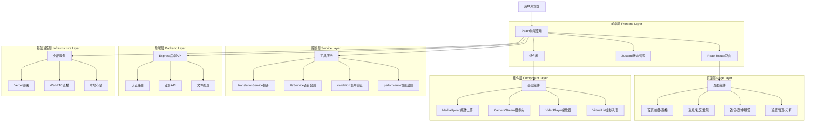
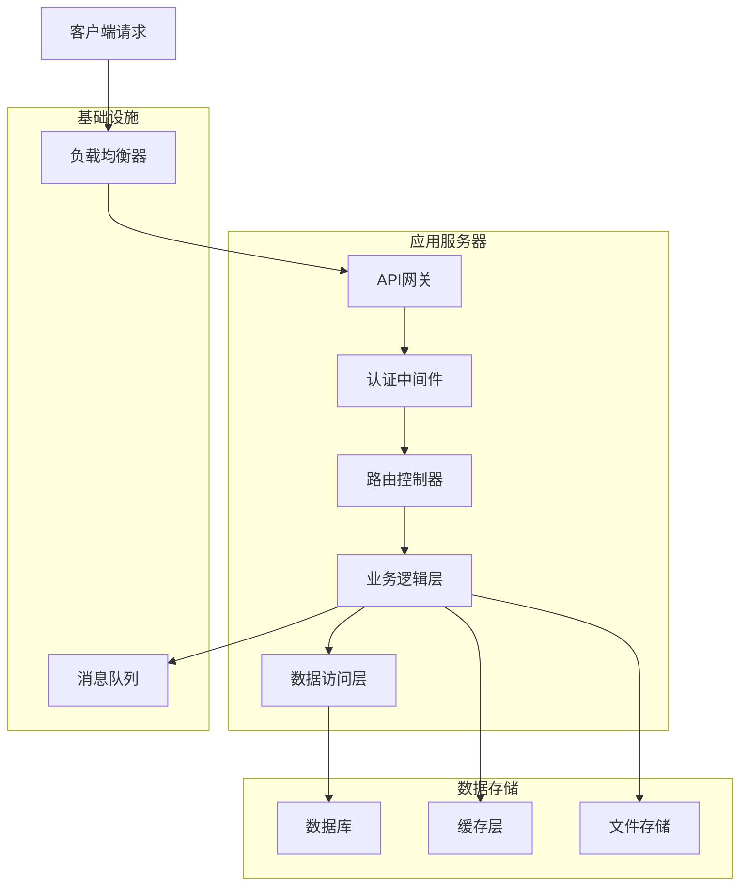

# 隐私短视频社交平台 - 技术架构文档

## 1. Architecture design



## 2. Technology Description

### 2.1 核心技术栈

* **前端框架：** React 18.3.1 + TypeScript 5.8.3 + Vite 6.3.5

* **状态管理：** Zustand 5.0.3 (轻量级状态管理)

* **路由管理：** React Router DOM 7.3.0 (单页应用路由)

* **样式框架：** Tailwind CSS 3.4.17 (原子化CSS框架)

* **图标库：** Lucide React 0.511.0 (现代化图标组件)

* **工具库：** clsx 2.1.1 + tailwind-merge 3.0.2 (样式合并)

* **通知系统：** Sonner 2.0.7 (Toast通知组件)

### 2.2 后端技术

* **后端框架：** Express 4.21.2 + TypeScript + Node.js

* **数据库：** SQLite3 5.1.7 + Sequelize 6.37.7 (ORM框架)

* **文件上传：** Multer 2.0.2 (多媒体文件处理)

* **加密安全：** Crypto-js 4.2.0 (数据加密)

* **实时通信：** Socket.io-client 4.8.1 (WebSocket通信)

* **WebRTC：** Simple-peer 9.11.1 (点对点通信)

* **开发工具：** nodemon 3.1.10 + tsx 4.20.3 (热重载开发)

* **API支持：** CORS 2.8.5 (跨域资源共享)

* **环境配置：** dotenv 17.2.1 (环境变量管理)

### 2.3 开发工具链

* **构建工具：** Vite 6.3.5 (快速构建和热重载)

* **代码规范：** ESLint 9.25.0 + TypeScript ESLint 8.30.1

* **样式处理：** PostCSS 8.5.3 + Autoprefixer 10.4.21

* **并发开发：** concurrently 9.2.0 (同时运行前后端)

* **类型检查：** TypeScript 5.8.3 (静态类型检查)

### 2.4 功能特性

* **数据存储：** 本地存储 + 模拟数据 (开发阶段)

* **媒体处理：** 原生File API + MediaUpload组件 + MediaPreview组件

* **文件上传：** 拖拽上传 + 进度显示 + 格式验证 + 预览功能

* **AI智能服务：** 模拟AI服务 (语音识别、语音合成、机器翻译、智能字幕)

* **实时功能：** WebSocket模拟 + WebRTC摄像头流 + 本地状态管理

* **性能优化：** LazyImage懒加载 + VirtualList虚拟滚动 + React.memo优化

* **用户体验：** LoadingSpinner + Toast通知 + UserFeedback + 表单验证

* **支付系统：** 多种支付方式 + 安全机制 + 倒计时确认 + 二次验证

* **直播功能：** CameraStream组件 + WebRTC API + 摄像头切换

* **响应式设计：** 移动端优先 + 触摸交互优化 + 横向滚动导航

### 2.5 部署配置

* **部署平台：** Vercel (前端部署) + @vercel/node 5.3.6

* **开发服务器：** Vite开发服务器 + Express后端服务

* **构建优化：** TypeScript编译 + Vite生产构建

* **插件扩展：** vite-plugin-trae-solo-badge 1.0.0 + vite-tsconfig-paths 5.1.4

## 3. Route definitions

| Route            | Purpose                    |
| ---------------- | -------------------------- |
| /                | 首页，显示推荐视频流和6个Tab导航，增强视频播放器 |
| /capture         | 拍摄页面，录制视频和本地上传，高级编辑工具      |
| /photo           | 图片发布页，照片编辑和发布，水印保护         |
| /live            | 直播页面，实时直播和观众互动，弹幕连麦        |
| /profile         | 个人主页，用户资料和作品展示，数据统计        |
| /messages        | 消息页面，私聊和群聊列表，消息搜索          |
| /chat/:id        | 聊天详情页，端到端加密聊天，阅后即焚         |
| /discover        | 发现页面，热门话题和用户推荐，热门直播区域      |
| /square          | 广场页面，瀑布流布局，搜索筛选，点赞交互       |
| /wallet          | 钱包页面，余额管理和收益统计，加密货币        |
| /shop            | 商城页面，商品浏览和购物车，订单管理         |
| /second-hand     | 二手市场页，二手商品交易和管理            |
| /ads             | 广告中心，广告投放和数据分析，营销工具        |
| /settings        | 设置页面，隐私安全和AI功能配置           |
| /ai-subtitle     | AI字幕中心，字幕管理和翻译设置           |
| /moderation      | 内容审核中心，举报处理和违规检测           |
| /analytics       | 数据分析中心，用户画像和内容分析           |
| /crypto          | 加密货币中心，数字钱包和交易管理           |
| /fraud-shield    | 反诈骗中心，风险监控和安全教育            |
| /reward          | 悬赏任务中心，任务发布和浏览，竞标管理        |
| /reward/publish  | 悬赏发布页，任务描述，媒体上传，预算设置       |
| /reward/:taskId  | 悬赏详情页，任务详情，竞标列表，文件提交       |
| /reward/rules    | 悬赏规则页面，平台规则和使用说明           |
| /reward/manage   | 悬赏管理页，我的发布，我的接单，收益统计       |
| /credit          | 信用中心页，信用评级，历史记录，信用提升       |
| /video/:videoId  | 视频详情页，视频播放，评论互动，分享收藏       |
| /debug/video     | 视频调试页，开发工具，测试功能，性能监控       |
| /drafts          | 草稿管理页，草稿列表，编辑恢复，自动保存       |
| /secondhand      | 二手市场页，二手商品交易和管理            |
| /subtitle-center | AI字幕中心，字幕管理和翻译设置           |
| /image-publish   | 图片发布页，照片编辑和发布，水印保护         |
| /live-streaming  | 直播页面，实时直播和观众互动，弹幕连麦        |
| /terms           | 服务条款页面，用户协议和平台规则           |
| /privacy         | 隐私政策页面，数据保护和隐私说明           |
| /forgot-password | 忘记密码页面，密码重置和账户恢复           |
| /login           | 登录页面，邮箱验证登录，两步验证           |
| /register        | 注册页面，邮箱验证注册，用户协议           |

## 4. API definitions

### 4.1 Core API

### 4.1 认证相关API

**用户登录**

```
POST /api/auth/login
```

Request:

| Param Name    | Param Type | isRequired | Description |
| ------------- | ---------- | ---------- | ----------- |
| email         | string     | true       | 用户邮箱        |
| password      | string     | true       | 用户密码        |
| twoFactorCode | string     | false      | 两步验证码       |

Response:

| Param Name        | Param Type | Description |
| ----------------- | ---------- | ----------- |
| success           | boolean    | 登录是否成功      |
| token             | string     | JWT认证令牌     |
| user              | object     | 用户信息        |
| requiresTwoFactor | boolean    | 是否需要两步验证    |

**用户注册**

```
POST /api/auth/register
```

Request:

| Param Name         | Param Type | isRequired | Description |
| ------------------ | ---------- | ---------- | ----------- |
| email              | string     | true       | 邮箱地址        |
| password           | string     | true       | 密码          |
| verification\_code | string     | true       | 邮箱验证码       |
| username           | string     | true       | 用户名         |

Response:

| Param Name | Param Type | Description |
| ---------- | ---------- | ----------- |
| success    | boolean    | 注册是否成功      |
| user       | object     | 用户信息        |
| token      | string     | JWT访问令牌     |

```
POST /api/auth/send-verification
```

Request:

| Param Name | Param Type | isRequired | Description                 |
| ---------- | ---------- | ---------- | --------------------------- |
| email      | string     | true       | 邮箱地址                        |
| type       | string     | true       | 验证类型 (register/login/reset) |

Response:

| Param Name  | Param Type | Description |
| ----------- | ---------- | ----------- |
| success     | boolean    | 发送是否成功      |
| expires\_in | number     | 验证码有效期(秒)   |

### 4.2 视频相关API

**视频上传**

```
POST /api/videos/upload
```

**视频列表**

```
GET /api/videos/feed
```

**视频详情**

```
GET /api/videos/:id
```

### 4.3 直播相关API

**开始直播**

```
POST /api/live/start
```

**直播列表**

```
GET /api/live/list
```

**直播互动**

```
POST /api/live/:id/interact
```

### 4.4 消息相关API

**发送消息**

```
POST /api/messages/send
```

**消息列表**

```
GET /api/messages/conversations
```

**实时翻译**

```
POST /api/messages/translate
```

### 4.5 AI功能API

**字幕生成**

```
POST /api/ai/subtitle/generate
```

**语音转文字**

```
POST /api/ai/speech-to-text
```

**内容翻译**

```
POST /api/ai/translate
```

### 4.6 商业功能API

**钱包余额**

```
GET /api/wallet/balance
```

**商品列表**

```
GET /api/shop/products
```

**广告投放**

```
POST /api/ads/create
```

### 4.7 悬赏任务API

**发布悬赏任务**

```
POST /api/reward/publish
```

Request:

| Param Name   | Param Type | isRequired | Description   |
| ------------ | ---------- | ---------- | ------------- |
| title        | string     | true       | 任务标题          |
| description  | string     | true       | 任务描述          |
| budget       | number     | true       | 任务预算          |
| deadline     | string     | true       | 截止时间          |
| location     | object     | false      | 地理位置信息        |
| media\_files | array      | false      | 媒体文件列表（最多10个） |
| category     | string     | true       | 任务分类          |

Response:

| Param Name      | Param Type | Description |
| --------------- | ---------- | ----------- |
| task\_id        | string     | 任务唯一标识      |
| status          | string     | 发布状态        |
| deposit\_amount | number     | 需要支付的质押金额   |

**获取悬赏任务列表**

```
GET /api/reward/tasks
```

**竞标任务**

```
POST /api/reward/:taskId/bid
```

**提交完成证明**

```
POST /api/reward/:taskId/submit
```

### 4.8 媒体文件API

**文件上传**

```
POST /api/media/upload
```

Request:

| Param Name | Param Type | isRequired | Description                                 |
| ---------- | ---------- | ---------- | ------------------------------------------- |
| file       | file       | true       | 媒体文件（图片、视频、PPT、Word、Excel）                  |
| file\_type | string     | true       | 文件类型                                        |
| purpose    | string     | true       | 用途（reward\_publish/reward\_submit/profile等） |

Response:

| Param Name       | Param Type | Description |
| ---------------- | ---------- | ----------- |
| file\_id         | string     | 文件唯一标识      |
| file\_url        | string     | 文件访问地址      |
| file\_size       | number     | 文件大小        |
| upload\_progress | number     | 上传进度        |

### 4.9 安全功能API

**内容审核**

```
POST /api/moderation/review
```

**风险检测**

```
POST /api/fraud/detect
```

**数据分析**

```
GET /api/analytics/dashboard
```

### 4.8 悬赏任务API

**发布悬赏任务**

```
POST /api/reward/publish
```

**获取任务列表**

```
GET /api/reward/tasks
```

**任务详情**

```
GET /api/reward/tasks/:taskId
```

**竞标任务**

```
POST /api/reward/tasks/:taskId/bid
```

**提交完成证明**

```
POST /api/reward/tasks/:taskId/submit
```

### 4.9 媒体文件上传API

**文件上传**

```
POST /api/media/upload
```

**文件预览**

```
GET /api/media/preview/:fileId
```

### 4.10 广场功能API

**获取广场内容**

```
GET /api/square/content
```

**点赞内容**

```
POST /api/square/like
```

### 4.11 搜索功能API

**综合搜索**

```
GET /api/search
```

**热门搜索**

```
GET /api/search/trending
```

**视频相关API**

```
GET /api/videos
```

Request:

| Param Name | Param Type | isRequired | Description |
| ---------- | ---------- | ---------- | ----------- |
| page       | number     | false      | 页码，默认1      |
| limit      | number     | false      | 每页数量，默认10   |
| category   | string     | false      | 视频分类        |
| userId     | string     | false      | 用户ID筛选      |

Response:

| Param Name | Param Type | Description |
| ---------- | ---------- | ----------- |
| success    | boolean    | 请求是否成功      |
| data       | object     | 视频列表和分页信息   |

```
GET /api/videos/:id
```

Response:

| Param Name | Param Type | Description |
| ---------- | ---------- | ----------- |
| success    | boolean    | 请求是否成功      |
| data       | object     | 视频详情信息      |

```
POST /api/videos
```

Request:

| Param Name     | Param Type | isRequired | Description  |
| -------------- | ---------- | ---------- | ------------ |
| user\_id       | string     | true       | 用户ID         |
| title          | string     | true       | 视频标题         |
| description    | string     | false      | 视频描述         |
| category       | string     | true       | 视频分类         |
| tags           | array      | false      | 标签列表         |
| duration       | number     | true       | 视频时长(秒)      |
| video\_url     | string     | false      | 视频URL        |
| thumbnail\_url | string     | false      | 缩略图URL       |
| is\_private    | boolean    | false      | 是否私密，默认false |

Response:

| Param Name | Param Type | Description |
| ---------- | ---------- | ----------- |
| success    | boolean    | 发布是否成功      |
| data       | object     | 视频信息        |
| requestId  | string     | 请求ID        |

```
POST /api/videos/upload-local
```

Request:

| Param Name     | Param Type | isRequired | Description                   |
| -------------- | ---------- | ---------- | ----------------------------- |
| video\_file    | file       | true       | 本地视频文件                        |
| title          | string     | false      | 视频标题                          |
| description    | string     | false      | 视频描述                          |
| privacy\_level | string     | true       | 隐私级别 (public/friends/private) |

Response:

| Param Name         | Param Type | Description |
| ------------------ | ---------- | ----------- |
| video\_id          | string     | 视频唯一标识      |
| processing\_status | string     | 处理状态        |

**直播相关**

```
POST /api/live/start
```

Request:

| Param Name  | Param Type | isRequired | Description |
| ----------- | ---------- | ---------- | ----------- |
| title       | string     | true       | 直播标题        |
| description | string     | false      | 直播描述        |
| category    | string     | false      | 直播分类        |

Response:

| Param Name  | Param Type | Description |
| ----------- | ---------- | ----------- |
| stream\_id  | string     | 直播流ID       |
| stream\_key | string     | 推流密钥        |
| rtmp\_url   | string     | RTMP推流地址    |

```
GET /api/live/popular
```

Response:

| Param Name | Param Type | Description |
| ---------- | ---------- | ----------- |
| streams    | array      | 热门直播列表      |
| total      | number     | 总数          |

**消息相关**

```
POST /api/messages/send
```

Request:

| Param Name    | Param Type | isRequired | Description             |
| ------------- | ---------- | ---------- | ----------------------- |
| chat\_id      | string     | true       | 聊天会话ID                  |
| content       | string     | true       | 加密后的消息内容                |
| message\_type | string     | true       | 消息类型 (text/image/video) |

Response:

| Param Name       | Param Type | Description |
| ---------------- | ---------- | ----------- |
| message\_id      | string     | 消息ID        |
| timestamp        | number     | 发送时间戳       |
| delivery\_status | string     | 投递状态        |

**AI功能相关**

```
POST /api/ai/speech-to-text
```

Request:

| Param Name      | Param Type | isRequired | Description                  |
| --------------- | ---------- | ---------- | ---------------------------- |
| audio\_file     | file       | true       | 音频文件                         |
| language        | string     | false      | 源语言代码 (auto-detect if empty) |
| enable\_offline | boolean    | false      | 是否使用离线模式                     |

Response:

| Param Name       | Param Type | Description |
| ---------------- | ---------- | ----------- |
| text             | string     | 识别出的文字      |
| confidence       | number     | 识别置信度       |
| language         | string     | 检测到的语言      |
| processing\_time | number     | 处理时间(ms)    |

```
POST /api/ai/translate
```

Request:

| Param Name       | Param Type | isRequired | Description |
| ---------------- | ---------- | ---------- | ----------- |
| text             | string     | true       | 待翻译文本       |
| source\_language | string     | false      | 源语言代码       |
| target\_language | string     | true       | 目标语言代码      |
| enable\_offline  | boolean    | false      | 是否使用离线翻译    |

Response:

| Param Name         | Param Type | Description |
| ------------------ | ---------- | ----------- |
| translated\_text   | string     | 翻译后的文本      |
| confidence         | number     | 翻译置信度       |
| detected\_language | string     | 检测到的源语言     |

```
POST /api/ai/text-to-speech
```

Request:

| Param Name | Param Type | isRequired | Description         |
| ---------- | ---------- | ---------- | ------------------- |
| text       | string     | true       | 待合成的文本              |
| language   | string     | true       | 语言代码                |
| voice\_id  | string     | false      | 语音ID (默认使用系统语音)     |
| speed      | number     | false      | 语速 (0.5-2.0, 默认1.0) |

Response:

| Param Name  | Param Type | Description |
| ----------- | ---------- | ----------- |
| audio\_url  | string     | 音频文件URL     |
| duration    | number     | 音频时长(秒)     |
| voice\_info | object     | 使用的语音信息     |

## 5. Server architecture diagram



## 6. Data model

### 6.1 Data model definition

```mermaid
erDiagram
    USER ||--o{ VIDEO : creates
    USER ||--o{ COMMENT : writes
    USER ||--o{ LIKE : gives
    USER ||--o{ FOLLOW : follows
    USER ||--o{ MESSAGE : sends
    USER ||--o{ LIVE_STREAM : hosts
    USER ||--o{ WALLET : owns
    USER ||--o{ ORDER : places
    USER ||--o{ AD_CAMPAIGN : creates
    USER ||--o{ REWARD_TASK : publishes
    USER ||--o{ REWARD_BID : makes
    USER ||--o{ MEDIA_FILE : uploads
    USER ||--o{ CREDIT_RECORD : has
    
    VIDEO ||--o{ COMMENT : has
    VIDEO ||--o{ LIKE : receives
    VIDEO ||--o{ SUBTITLE : contains
    VIDEO ||--o{ MODERATION_LOG : reviewed
    
    LIVE_STREAM ||--o{ LIVE_COMMENT : receives
    LIVE_STREAM ||--o{ GIFT : receives
    
    REWARD_TASK ||--o{ REWARD_BID : receives
    REWARD_TASK ||--o{ MEDIA_FILE : contains
    REWARD_BID ||--o{ MEDIA_FILE : includes
    
    WALLET ||--o{ TRANSACTION : records
    WALLET ||--o{ CRYPTO_HOLDING : contains
    
    SHOP ||--o{ PRODUCT : contains
    PRODUCT ||--o{ ORDER_ITEM : includes
    ORDER ||--o{ ORDER_ITEM : contains
    
    REWARD_TASK ||--o{ TASK_BID : receives
    REWARD_TASK ||--o{ MEDIA_FILE : contains
    TASK_BID ||--o{ MEDIA_FILE : includes
    
    SQUARE_CONTENT ||--o{ SQUARE_LIKE : receives
    USER ||--o{ SQUARE_LIKE : gives
    
    USER {
        string id PK
        string username UK
        string email UK
        string nickname
        string avatar
        string bio
        string location
        string website
        date birthday
        integer follower_count
        integer following_count
        integer video_count
        integer like_count
        boolean is_verified
        boolean is_active
        timestamp last_login
        timestamp created_at
        timestamp updated_at
    }
    
    VIDEO {
        string id PK
        string user_id FK
        string title
        string description
        string category
        json tags
        integer duration
        string video_url
        string thumbnail_url
        string file_path
        integer file_size
        string resolution
        string format
        float quality_score
        integer view_count
        integer like_count
        integer comment_count
        integer share_count
        boolean is_private
        boolean is_published
        timestamp published_at
        timestamp created_at
        timestamp updated_at
    }
    
    SUBTITLE {
        uuid id PK
        uuid video_id FK
        string language
        json subtitle_data
        string ai_generated
        timestamp created_at
    }
    
    MESSAGE {
        uuid id PK
        uuid sender_id FK
        uuid receiver_id FK
        string content
        string message_type
        boolean is_read
        boolean is_encrypted
        integer expires_at
        timestamp created_at
    }
    
    WALLET {
        uuid id PK
        uuid user_id FK
        decimal balance
        decimal frozen_balance
        string currency
        timestamp created_at
        timestamp updated_at
    }
    
    TRANSACTION {
        uuid id PK
        uuid wallet_id FK
        string type
        decimal amount
        string description
        string status
        timestamp created_at
    }
    
    PRODUCT {
        uuid id PK
        string name
        string description
        decimal price
        integer stock
        string category
        json images
        timestamp created_at
    }
    
    ORDER {
        uuid id PK
        uuid user_id FK
        decimal total_amount
        string status
        json shipping_info
        timestamp created_at
    }
    
    AD_CAMPAIGN {
        uuid id PK
        uuid user_id FK
        string name
        decimal budget
        string status
        json targeting
        timestamp created_at
    }
    
    MODERATION_LOG {
        uuid id PK
        uuid content_id FK
        string content_type
        string action
        string reason
        uuid moderator_id FK
        timestamp created_at
    }
    
    REWARD_TASK {
        uuid id PK
        uuid publisher_id FK
        string title
        string description
        decimal budget
        decimal deposit_amount
        string category
        json location_info
        string status
        timestamp deadline
        timestamp created_at
        timestamp updated_at
    }
    
    REWARD_BID {
        uuid id PK
        uuid task_id FK
        uuid bidder_id FK
        decimal bid_amount
        string proposal
        string status
        timestamp created_at
    }
    
    MEDIA_FILE {
        uuid id PK
        uuid user_id FK
        uuid related_id FK
        string file_name
        string file_type
        string file_url
        integer file_size
        string purpose
        json metadata
        timestamp created_at
    }
    
    CREDIT_RECORD {
        uuid id PK
        uuid user_id FK
        integer credit_score
        string record_type
        string description
        timestamp created_at
    }
    
    SQUARE_CONTENT {
        uuid id PK
        uuid user_id FK
        string content_type
        string title
        string description
        string media_url
        integer like_count
        string category
        timestamp created_at
    }
    
    SQUARE_LIKE {
        uuid id PK
        uuid user_id FK
        uuid content_id FK
        timestamp created_at
        UNIQUE(user_id, content_id)
    }
```

### 6.2 Data Definition Language

**用户表 (users)**

```sql
-- 创建用户表
CREATE TABLE users (
    id VARCHAR(255) PRIMARY KEY,
    username VARCHAR(255) UNIQUE NOT NULL,
    email VARCHAR(255) UNIQUE,
    nickname VARCHAR(255) NOT NULL,
    avatar TEXT,
    bio TEXT,
    location VARCHAR(255),
    website VARCHAR(255),
    birthday DATE,
    follower_count INTEGER DEFAULT 0,
    following_count INTEGER DEFAULT 0,
    video_count INTEGER DEFAULT 0,
    like_count INTEGER DEFAULT 0,
    is_verified BOOLEAN DEFAULT FALSE,
    is_active BOOLEAN DEFAULT TRUE,
    last_login TIMESTAMP,
    created_at TIMESTAMP DEFAULT CURRENT_TIMESTAMP,
    updated_at TIMESTAMP DEFAULT CURRENT_TIMESTAMP
);

-- 创建索引
CREATE UNIQUE INDEX idx_users_username ON users(username);
CREATE UNIQUE INDEX idx_users_email ON users(email);
```

**视频表 (videos)**

```sql
-- 创建视频表
CREATE TABLE videos (
    id VARCHAR(255) PRIMARY KEY,
    user_id VARCHAR(255) NOT NULL,
    title VARCHAR(255) NOT NULL,
    description TEXT,
    category VARCHAR(255) NOT NULL,
    tags JSON DEFAULT '[]',
    duration INTEGER NOT NULL,
    video_url TEXT,
    thumbnail_url TEXT,
    file_path VARCHAR(255),
    file_size INTEGER,
    resolution VARCHAR(50),
    format VARCHAR(20),
    quality_score REAL DEFAULT 5.0,
    view_count INTEGER DEFAULT 0,
    like_count INTEGER DEFAULT 0,
    comment_count INTEGER DEFAULT 0,
    share_count INTEGER DEFAULT 0,
    is_private BOOLEAN DEFAULT FALSE,
    is_published BOOLEAN DEFAULT FALSE,
    published_at TIMESTAMP,
    created_at TIMESTAMP DEFAULT CURRENT_TIMESTAMP,
    updated_at TIMESTAMP DEFAULT CURRENT_TIMESTAMP,
    FOREIGN KEY (user_id) REFERENCES users(id)
);

-- 创建索引
CREATE INDEX idx_videos_user_id ON videos(user_id);
CREATE INDEX idx_videos_category ON videos(category);
CREATE INDEX idx_videos_published_at ON videos(published_at DESC);
CREATE INDEX idx_videos_is_published ON videos(is_published);
```

**用户行为表 (user\_behaviors)**

```sql
-- 创建用户行为表
CREATE TABLE user_behaviors (
    id VARCHAR(255) PRIMARY KEY,
    user_id VARCHAR(255) NOT NULL,
    video_id VARCHAR(255) NOT NULL,
    action_type VARCHAR(50) NOT NULL,
    action_data JSON,
    created_at TIMESTAMP DEFAULT CURRENT_TIMESTAMP,
    FOREIGN KEY (user_id) REFERENCES users(id),
    FOREIGN KEY (video_id) REFERENCES videos(id)
);

-- 创建索引
CREATE INDEX idx_user_behaviors_user_id ON user_behaviors(user_id);
CREATE INDEX idx_user_behaviors_video_id ON user_behaviors(video_id);
CREATE INDEX idx_user_behaviors_action_type ON user_behaviors(action_type);
```

**视频表 (videos)**

```sql
-- 创建视频表
CREATE TABLE videos (
    id UUID PRIMARY KEY DEFAULT gen_random_uuid(),
    user_id UUID NOT NULL,
    title VARCHAR(200),
    description TEXT,
    video_url TEXT NOT NULL,
    thumbnail_url TEXT,
    duration INTEGER NOT NULL,
    privacy_level VARCHAR(20) DEFAULT 'public' CHECK (privacy_level IN ('public', 'friends', 'private')),
    view_count INTEGER DEFAULT 0,
    like_count INTEGER DEFAULT 0,
    comment_count INTEGER DEFAULT 0,
    created_at TIMESTAMP WITH TIME ZONE DEFAULT NOW(),
    updated_at TIMESTAMP WITH TIME ZONE DEFAULT NOW()
);

-- 创建索引
CREATE INDEX idx_videos_user_id ON videos(user_id);
CREATE INDEX idx_videos_created_at ON videos(created_at DESC);
CREATE INDEX idx_videos_privacy_level ON videos(privacy_level);
CREATE INDEX idx_videos_view_count ON videos(view_count DESC);

-- 权限设置
GRANT SELECT ON videos TO anon;
GRANT ALL PRIVILEGES ON videos TO authenticated;
```

**聊天表 (chats)**

```sql
-- 创建聊天表
CREATE TABLE chats (
    id UUID PRIMARY KEY DEFAULT gen_random_uuid(),
    chat_type VARCHAR(20) DEFAULT 'private' CHECK (chat_type IN ('private', 'group')),
    name VARCHAR(100),
    is_encrypted BOOLEAN DEFAULT true,
    created_at TIMESTAMP WITH TIME ZONE DEFAULT NOW(),
    updated_at TIMESTAMP WITH TIME ZONE DEFAULT NOW()
);

-- 创建消息表
CREATE TABLE messages (
    id UUID PRIMARY KEY DEFAULT gen_random_uuid(),
    chat_id UUID NOT NULL,
    sender_id UUID NOT NULL,
    encrypted_content TEXT NOT NULL,
    message_type VARCHAR(20) DEFAULT 'text' CHECK (message_type IN ('text', 'image', 'video', 'file')),
    is_deleted BOOLEAN DEFAULT false,
    expires_at TIMESTAMP WITH TIME ZONE,
    created_at TIMESTAMP WITH TIME ZONE DEFAULT NOW()
);

-- 创建索引
CREATE INDEX idx_messages_chat_id ON messages(chat_id);
CREATE INDEX idx_messages_created_at ON messages(created_at DESC);
CREATE INDEX idx_messages_sender_id ON messages(sender_id);

-- 权限设置
GRANT ALL PRIVILEGES ON chats TO authenticated;
GRANT ALL PRIVILEGES ON messages TO authenticated;
```

**关注关系表 (follows)**

````sql
-- 创建关注表
CREATE TABLE follows (
    id UUID PRIMARY KEY DEFAULT gen_random_uuid(),
    follower_id UUID NOT NULL,
    following_id UUID NOT NULL,
    created_at TIMESTAMP WITH TIME ZONE DEFAULT NOW(),
    UNIQUE(follower_id, following_id)
);

-- 创建索引
CREATE INDEX idx_follows_follower_id ON follows(follower_id);
CREATE INDEX idx_follows_following_id ON follows(following_id);
CREATE INDEX idx_follows_created_at ON follows(created_at DESC);

-- 权限设置
GRANT SELECT ON follows TO anon;
GRANT ALL PRIVILEGES ON follows TO authenticated;

**悬赏任务表 (reward_tasks)**

```sql
-- 创建悬赏任务表
CREATE TABLE reward_tasks (
    id UUID PRIMARY KEY DEFAULT gen_random_uuid(),
    publisher_id UUID NOT NULL,
    title VARCHAR(200) NOT NULL,
    description TEXT NOT NULL,
    budget DECIMAL(10,2) NOT NULL,
    deposit_amount DECIMAL(10,2) NOT NULL,
    category VARCHAR(50) NOT NULL,
    location_info JSON,
    status VARCHAR(20) DEFAULT 'published' CHECK (status IN ('published', 'in_progress', 'completed', 'cancelled')),
    deadline TIMESTAMP WITH TIME ZONE NOT NULL,
    created_at TIMESTAMP WITH TIME ZONE DEFAULT NOW(),
    updated_at TIMESTAMP WITH TIME ZONE DEFAULT NOW()
);

-- 创建索引
CREATE INDEX idx_reward_tasks_publisher_id ON reward_tasks(publisher_id);
CREATE INDEX idx_reward_tasks_status ON reward_tasks(status);
CREATE INDEX idx_reward_tasks_category ON reward_tasks(category);
CREATE INDEX idx_reward_tasks_deadline ON reward_tasks(deadline);
CREATE INDEX idx_reward_tasks_created_at ON reward_tasks(created_at DESC);

-- 权限设置
GRANT SELECT ON reward_tasks TO anon;
GRANT ALL PRIVILEGES ON reward_tasks TO authenticated;
````

**悬赏竞标表 (reward\_bids)**

```sql
-- 创建悬赏竞标表
CREATE TABLE reward_bids (
    id UUID PRIMARY KEY DEFAULT gen_random_uuid(),
    task_id UUID NOT NULL,
    bidder_id UUID NOT NULL,
    bid_amount DECIMAL(10,2) NOT NULL,
    proposal TEXT,
    status VARCHAR(20) DEFAULT 'pending' CHECK (status IN ('pending', 'accepted', 'rejected', 'completed')),
    created_at TIMESTAMP WITH TIME ZONE DEFAULT NOW(),
    UNIQUE(task_id, bidder_id)
);

-- 创建索引
CREATE INDEX idx_reward_bids_task_id ON reward_bids(task_id);
CREATE INDEX idx_reward_bids_bidder_id ON reward_bids(bidder_id);
CREATE INDEX idx_reward_bids_status ON reward_bids(status);
CREATE INDEX idx_reward_bids_created_at ON reward_bids(created_at DESC);

-- 权限设置
GRANT ALL PRIVILEGES ON reward_bids TO authenticated;
```

**媒体文件表 (media\_files)**

```sql
-- 创建媒体文件表
CREATE TABLE media_files (
    id UUID PRIMARY KEY DEFAULT gen_random_uuid(),
    user_id UUID NOT NULL,
    related_id UUID,
    file_name VARCHAR(255) NOT NULL,
    file_type VARCHAR(50) NOT NULL,
    file_url TEXT NOT NULL,
    file_size INTEGER NOT NULL,
    purpose VARCHAR(50) NOT NULL CHECK (purpose IN ('reward_publish', 'reward_submit', 'profile', 'video', 'chat')),
    metadata JSON,
    created_at TIMESTAMP WITH TIME ZONE DEFAULT NOW()
);

-- 创建索引
CREATE INDEX idx_media_files_user_id ON media_files(user_id);
CREATE INDEX idx_media_files_related_id ON media_files(related_id);
CREATE INDEX idx_media_files_purpose ON media_files(purpose);
CREATE INDEX idx_media_files_file_type ON media_files(file_type);
CREATE INDEX idx_media_files_created_at ON media_files(created_at DESC);

-- 权限设置
GRANT SELECT ON media_files TO anon;
GRANT ALL PRIVILEGES ON media_files TO authenticated;
```

**信用记录表 (credit\_records)**

```sql
-- 创建信用记录表
CREATE TABLE credit_records (
    id UUID PRIMARY KEY DEFAULT gen_random_uuid(),
    user_id UUID NOT NULL,
    credit_score INTEGER NOT NULL DEFAULT 100,
    record_type VARCHAR(50) NOT NULL CHECK (record_type IN ('task_completed', 'task_cancelled', 'payment_delayed', 'dispute_resolved')),
    description TEXT,
    related_task_id UUID,
    score_change INTEGER DEFAULT 0,
    created_at TIMESTAMP WITH TIME ZONE DEFAULT NOW()
);

-- 创建索引
CREATE INDEX idx_credit_records_user_id ON credit_records(user_id);
CREATE INDEX idx_credit_records_record_type ON credit_records(record_type);
CREATE INDEX idx_credit_records_created_at ON credit_records(created_at DESC);

-- 权限设置
GRANT ALL PRIVILEGES ON credit_records TO authenticated;
```

**字幕表 (video\_subtitles)**

```sql
-- 创建字幕表
CREATE TABLE video_subtitles (
    id UUID PRIMARY KEY DEFAULT gen_random_uuid(),
    video_id UUID NOT NULL,
    original_text TEXT NOT NULL,
    language VARCHAR(10) NOT NULL,
    start_time INTEGER NOT NULL,
    end_time INTEGER NOT NULL,
    confidence DECIMAL(3,2) DEFAULT 0.95,
    is_auto_generated BOOLEAN DEFAULT true,
    created_at TIMESTAMP WITH TIME ZONE DEFAULT NOW()
);

-- 创建索引
CREATE INDEX idx_video_subtitles_video_id ON video_subtitles(video_id);
CREATE INDEX idx_video_subtitles_language ON video_subtitles(language);
CREATE INDEX idx_video_subtitles_time ON video_subtitles(start_time, end_time);

-- 权限设置
GRANT SELECT ON video_subtitles TO anon;
GRANT ALL PRIVILEGES ON video_subtitles TO authenticated;
```

**字幕翻译表 (subtitle\_translations)**

```sql
-- 创建字幕翻译表
CREATE TABLE subtitle_translations (
    id UUID PRIMARY KEY DEFAULT gen_random_uuid(),
    subtitle_id UUID NOT NULL,
    translated_text TEXT NOT NULL,
    target_language VARCHAR(10) NOT NULL,
    confidence DECIMAL(3,2) DEFAULT 0.90,
    translation_source VARCHAR(20) DEFAULT 'auto' CHECK (translation_source IN ('auto', 'manual', 'offline')),
    created_at TIMESTAMP WITH TIME ZONE DEFAULT NOW()
);

-- 创建索引
CREATE INDEX idx_subtitle_translations_subtitle_id ON subtitle_translations(subtitle_id);
CREATE INDEX idx_subtitle_translations_language ON subtitle_translations(target_language);

-- 权限设置
GRANT SELECT ON subtitle_translations TO anon;
GRANT ALL PRIVILEGES ON subtitle_translations TO authenticated;
```

**AI偏好设置表 (ai\_preferences)**

```sql
-- 创建AI偏好设置表
CREATE TABLE ai_preferences (
    id UUID PRIMARY KEY DEFAULT gen_random_uuid(),
    user_id UUID NOT NULL UNIQUE,
    preferred_language VARCHAR(10) DEFAULT 'zh-CN',
    auto_translate BOOLEAN DEFAULT false,
    offline_mode BOOLEAN DEFAULT false,
    voice_id VARCHAR(50) DEFAULT 'system_default',
    speech_speed DECIMAL(2,1) DEFAULT 1.0 CHECK (speech_speed >= 0.5 AND speech_speed <= 2.0),
    subtitle_style JSONB DEFAULT '{"fontSize": 16, "color": "#FFFFFF", "backgroundColor": "rgba(0,0,0,0.7)"}',
    updated_at TIMESTAMP WITH TIME ZONE DEFAULT NOW()
);

-- 创建索引
CREATE INDEX idx_ai_preferences_user_id ON ai_preferences(user_id);

-- 权限设置
GRANT ALL PRIVILEGES ON ai_preferences TO authenticated;
```

**直播表 (live\_streams)**

```sql
-- 创建直播表
CREATE TABLE live_streams (
    id UUID PRIMARY KEY DEFAULT gen_random_uuid(),
    user_id UUID NOT NULL,
    title VARCHAR(200) NOT NULL,
    description TEXT,
    category VARCHAR(50),
    stream_key VARCHAR(100) UNIQUE NOT NULL,
    rtmp_url TEXT NOT NULL,
    status VARCHAR(20) DEFAULT 'preparing' CHECK (status IN ('preparing', 'live', 'ended', 'paused')),
    viewer_count INTEGER DEFAULT 0,
    started_at TIMESTAMP WITH TIME ZONE,
    ended_at TIMESTAMP WITH TIME ZONE,
    created_at TIMESTAMP WITH TIME ZONE DEFAULT NOW()
);

-- 创建索引
CREATE INDEX idx_live_streams_user_id ON live_streams(user_id);
CREATE INDEX idx_live_streams_status ON live_streams(status);
CREATE INDEX idx_live_streams_started_at ON live_streams(started_at DESC);
CREATE INDEX idx_live_streams_viewer_count ON live_streams(viewer_count DESC);

-- 权限设置
GRANT SELECT ON live_streams TO anon;
GRANT ALL PRIVILEGES ON live_streams TO authenticated;
```

**钱包交易表 (wallet\_transactions)**

```sql
-- 创建钱包交易表
CREATE TABLE wallet_transactions (
    id UUID PRIMARY KEY DEFAULT gen_random_uuid(),
    user_id UUID NOT NULL,
    transaction_type VARCHAR(20) NOT NULL CHECK (transaction_type IN ('deposit', 'withdrawal', 'transfer', 'payment', 'reward')),
    amount DECIMAL(15,2) NOT NULL,
    currency VARCHAR(10) DEFAULT 'USD',
    status VARCHAR(20) DEFAULT 'pending' CHECK (status IN ('pending', 'completed', 'failed', 'cancelled')),
    description TEXT,
    metadata JSONB,
    created_at TIMESTAMP WITH TIME ZONE DEFAULT NOW()
);

-- 创建索引
CREATE INDEX idx_wallet_transactions_user_id ON wallet_transactions(user_id);
CREATE INDEX idx_wallet_transactions_type ON wallet_transactions(transaction_type);
CREATE INDEX idx_wallet_transactions_status ON wallet_transactions(status);
CREATE INDEX idx_wallet_transactions_created_at ON wallet_transactions(created_at DESC);

-- 权限设置
GRANT ALL PRIVILEGES ON wallet_transactions TO authenticated;
```

**加密货币钱包表 (crypto\_wallets)**

```sql
-- 创建加密货币钱包表
CREATE TABLE crypto_wallets (
    id UUID PRIMARY KEY DEFAULT gen_random_uuid(),
    user_id UUID NOT NULL,
    wallet_address VARCHAR(255) UNIQUE NOT NULL,
    currency_type VARCHAR(10) NOT NULL CHECK (currency_type IN ('BTC', 'ETH', 'USDT', 'USDC')),
    balance DECIMAL(20,8) DEFAULT 0,
    private_key_hash VARCHAR(255) NOT NULL,
    is_active BOOLEAN DEFAULT true,
    created_at TIMESTAMP WITH TIME ZONE DEFAULT NOW(),
    updated_at TIMESTAMP WITH TIME ZONE DEFAULT NOW()
);

-- 创建索引
CREATE INDEX idx_crypto_wallets_user_id ON crypto_wallets(user_id);
CREATE INDEX idx_crypto_wallets_currency ON crypto_wallets(currency_type);
CREATE INDEX idx_crypto_wallets_address ON crypto_wallets(wallet_address);
CREATE INDEX idx_crypto_wallets_active ON crypto_wallets(is_active);

-- 权限设置
GRANT ALL PRIVILEGES ON crypto_wallets TO authenticated;
```

